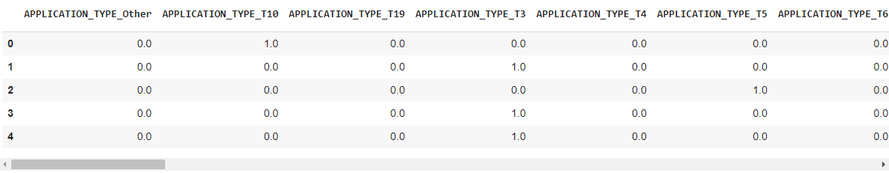

# DEEP LEARNING ASSIGNMENT - Charity Funding Predictor

## Background

For this assignment our goal was to create an algorithm to predict whether or not the applicants will be successful in getting funded. We were provided with the input file `charity_data.csv` which consisted of the following fields:

* **EIN** and **NAME**—Identification columns
* **APPLICATION_TYPE**—Alphabet Soup application type
* **AFFILIATION**—Affiliated sector of industry
* **CLASSIFICATION**—Government organization classification
* **USE_CASE**—Use case for funding
* **ORGANIZATION**—Organization type
* **STATUS**—Active status
* **INCOME_AMT**—Income classification
* **SPECIAL_CONSIDERATIONS**—Special consideration for application
* **ASK_AMT**—Funding amount requested
* **IS_SUCCESSFUL**—Was the money used effectively

Using this input file I performed the following operations :

### Pre-requistes: 

We used Google Colaboratory to create our modules. This assignment consisted of two important objectives
* First, to use Deep Learning Neural network to find the accuarcy of the model (Step 1 and 2) - `Starter_Code.ipynb`
* Second, perform three different optimizations to see if the accuracy increases beyond 75% (Step 3)

### Step 1: Preprocess the data

Following steps were used to preprocess the data
* Read the CSV file from local source
* Study the input file to find the features and target
  * We indentified `Target` as `IS_SUCCESSFUL` field
* EIN and NAME fields were dropped
* Created a bin callled `Other` for the following
  * `APPLICATION_TYPE` whose count < 500
  * `CLASSIFICATION` whose count < 1000
* I used `OneHotEncoder` to create a feature list as shown below
  
  * A total of 43 columns were created
* Finally we merged the one-hot encoded features in our dataframe and dropped the original columns
  * IMG
* We then performed final data processing of
  * Splitting the data into X and y
  * Splitting the data into Train and Test dataset
  * Scaling the data using `StandardScaler()`

Code in `Starter_Code.ipynb`

### Step 2: Compile, Train and Evaluate the Model

Following steps were used to preprocess the data
* Defined a deep Neural network with 3 layers
  * Layer 1 - 80 neurons, Activation - "relu", input = 43
  * Layer 2 - 30 neurons, Activation - "relu"
  * Output Layer - 1 neuron, activation - 'sigmoid'
* Model structure as follows
  * IMG
* Compiled and fitted the model for 100 epochs
* Results:
  * Training Stats - loss: 0.5357 - accuracy: 0.7390
  * Test Stats - Loss: 0.5580378770828247, Accuracy: 0.7314285635948181
* Model was saved in `AlphabetSoupCharity.h5`
* Accuracy for 100 epochs were as follows:
  * IMG
Code in `Starter_Code.ipynb`

### CONCULSION: Based on our Deep Neural Network model the accuracy of only 73% was observed. The model needs to be tweaked to see if any
